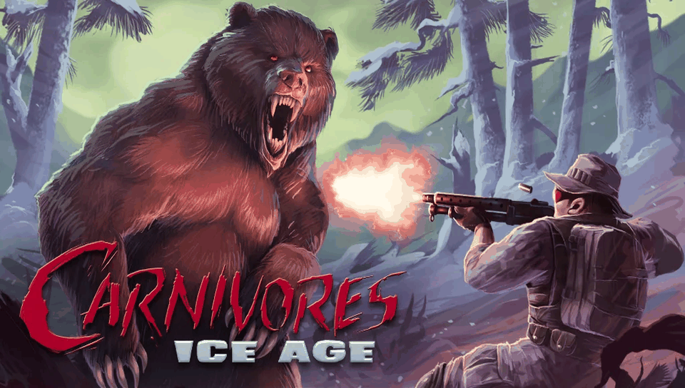

# CARNIVORES: ICE AGE — PS Vita Port

<p align="center">
  
</p>

<p align="center">
  <b>Native port of Carnivores: Ice Age (Tatem Games) for PlayStation Vita and PlayStation TV.</b>
</p>

<p align="center">
  
  
  
  
  
</p>

---

## 📖 Description

**Carnivores: Ice Age** is Tatem Games' prehistoric hunting game, originally released for Android as
`Carnivores__Ice_Age_1.5.4_Android_4.0.apk` (package `com.tatemgames.iceage`, version 1.5.4). This port runs the
original ARM libraries from the Android release — the game (`libIceAgeAndroid.so`) and its audio engine
(`libfmodex.so`), both `armeabi` — directly on the PS Vita's ARM Cortex-A9 processor, using a dynamic loader
(*soloader*) and an Android environment emulation layer (*FalsoJNI*), with
[vitaGL](https://github.com/Rinnegatamante/vitaGL) providing the OpenGL ES 1.1 rendering backend.

### 🎮 Current Status: Playable

The game **is playable from start to finish on real hardware**: menus, hunting in every area, all weapons,
calls, map, binoculars and save data. See [`port_progress.md`](port_progress.md) for the full bug-by-bug history.

### ✨ What Works

- **Native ARM execution**: `libIceAgeAndroid.so` and `libfmodex.so` are loaded at fixed addresses and run
  directly on the Vita's CPU; no emulation of game code. The JNI entry points (`Java_com_tatem_iceage_*`) are
  called in the same order as the Android `Activity`.
- **Assets straight from the APK**: the engine's own libzip opens `game.apk` (and the content packs) in place —
  nothing has to be extracted. Archives stay open for the whole session.
- **FPU instead of software floating point**: the APK is old `armeabi` code that does all float math in
  software. The libgcc soft-float helpers of **both** the game and FMOD are redirected to VFP instructions.
  Initial load: ~31 s → ~17 s.
- **Audio**: FMOD's Android `AudioTrack` output is emulated on top of the Vita's audio ports (music and SFX).
- **Physical controls**: both sticks and every in-game action on a button. The **right-stick camera** feeds the
  game's own camera input — fast, smooth and independent of the frame rate.
- **Clean HUD**: the touch buttons are drawn at 1 % opacity (they still work when touched); the compass keeps
  its full opacity. Configurable with `hud_opacity`.
- **Content packs**: `CarnivoresBundleOne.apk` (areas 3–4, sniper rifle) and `CarnivoresBundleTwo.apk` (area 6,
  double-barreled shotgun, crossbow) are unlocked when their APK is present (or a Google Play `main.obb`).
- **No freeze on missing weapon files**: the plain shotgun model is in none of the 1.5.4 files, and on Android
  the game locked up the first time a weapon without files was drawn. Such a weapon now keeps its own stats and
  borrows another weapon's model.

### 🕹️ Controls

| Vita input | Action |
|---|---|
| Left Analog | Move |
| Right Analog | Look around (sensitivity: `look_sensitivity`) |
| R / Cross | Fire |
| L | Alternative fire |
| Square | Weapon button: draw the weapon and open / close the weapon list |
| Triangle | Binoculars |
| Circle / D-Pad Up | Animal call |
| Select / D-Pad Down | Map |
| Start | Pause / back |
| Touch screen | Original touch controls (all of them keep working, even when transparent) |

Buttons press the game's own on-screen controls, so they only act while that control is on screen (in the
menus, use the touch screen).

### ⚠️ Known Issues

- **3D frame rate**: menus run at 60 FPS; hunting scenes are much slower (16–19 FPS measured before the FPU
  patch, not re-measured since). `msaa 0` helps if the GPU is the limit — `show_fps 1` tells which side it is.
- **Plain shotgun model**: drawn with the double-barreled shotgun model (or the rifle without pack 2), see
  [No freeze on missing weapon files](#-what-works).
- **Online features**: Facebook, Google Play Games, ads and in-app purchases are stubbed out.
- **No exit dialog**: the Android "Exit?" prompt is skipped; quit with the PS button.

If you hit a bug, grab the newest log from `ux0:data/carnivoresiceage/logs/` (and the `.psp2dmp` from
`ux0:data/` for a crash) and open an issue. `engine_log 1` in `config.txt` adds the game's own messages.

---

## 📋 Prerequisites

To run this port on your PS Vita or PS TV, you will need:

1. A PS Vita / PS TV console running Custom Firmware (**HENkaku** or **Enso**).
2. [**kubridge**](https://github.com/TheOfficialFloW/kubridge/releases) installed as a kernel plugin
   (`ur0:tai/config.txt` under `*KERNEL`).
3. [**libshacccg.suprx**](https://github.com/Rinnegatamante/ShaRKBR33D/releases/latest) installed in `ur0:data/`.
4. A legally obtained copy of **Carnivores: Ice Age 1.5.4** for Android (`com.tatemgames.iceage`, `armeabi`).
   Optionally, the two content pack APKs.

---

## 📦 Installation Instructions

1. Install `carnivoresiceage.vpk` on your console using **VitaShell**.
2. Create the folder `ux0:data/carnivoresiceage/`.
3. Copy the APK there, renamed to `game.apk`.
4. Open the APK with any zip extractor and copy `lib/armeabi/libIceAgeAndroid.so` and `lib/armeabi/libfmodex.so`
   to the same folder.
5. *(Optional)* Copy the content packs: `CarnivoresBundleOne.apk` and `CarnivoresBundleTwo.apk` (also accepted as
   `bundle1.apk` / `bundle2.apk`), or a Google Play expansion file named `main.obb` that contains both.
6. Launch the game from the LiveArea. The first boot creates `config.txt` and the `logs/` folder.

### Final File Structure in `ux0:data/carnivoresiceage/`

```text
ux0:data/carnivoresiceage/
├── game.apk                  <- The original APK, renamed
├── libIceAgeAndroid.so       <- lib/armeabi/ in the APK
├── libfmodex.so              <- lib/armeabi/ in the APK
├── CarnivoresBundleOne.apk   <- (optional) content pack 1: areas 3-4, sniper rifle
├── CarnivoresBundleTwo.apk   <- (optional) content pack 2: area 6, double-barreled shotgun, crossbow
├── config.txt                <- Settings (created on first boot)
└── logs/                     <- Incremental logs (carnivoresiceage_NNN.log)
```

### ⚙️ Options

`config.txt` is rewritten on every boot, so keys added by newer versions show up automatically. One
`key value` per line:

| Key | Default | Meaning |
|---|---|---|
| `language` | `0` | 0 = system language, 1 English, 2 German, 3 French, 4 Spanish |
| `unlock_bundles` | `1` | Treat both content packs as purchased (there is no store on Vita) |
| `look_sensitivity` | `100` | Right stick camera speed in percent (10–400). Stacks with the in-game sensitivity slider |
| `invert_look_y` | `0` | Invert the right stick vertical axis |
| `hud_opacity` | `1` | Opacity of the in-game touch buttons, percent of the original (0 hidden, 100 original). The compass and the weapon/call lists are not affected |
| `msaa` | `1` | Anti-aliasing: 0 off (fastest), 1 = 2x, 2 = 4x |
| `show_fps` | `0` | Every 5 s, log the frame rate and the CPU (engine) / GPU (swap) time per frame |
| `engine_log` | `0` | Also log the game's own debug messages (slow: it logs every frame; for bug reports) |
| `vfp_float` | `1` | Run the game's and FMOD's software floating point on the FPU. Set to 0 only to rule it out if something looks wrong |

---

## 🛠️ Building from Source

This port does **not** keep a local copy of `porting_tools/` — build, deploy, log, LiveArea and crash-dump
workflows are handled by **psvita-port-toolkit**, a standalone tool kept outside this repository.

### Build Prerequisites

- [**VitaSDK**](https://vitasdk.org) with `kubridge`, `vitashark` and `pthread`.
- CMake and Make.
- vitaGL is **vendored** in `vendor/vitaGL` and built automatically with `SOFTFP_ABI=1` — do not use VitaSDK's
  prebuilt `libvitaGL.a`: with it the game runs at 60 FPS on a permanently black screen.

### Build Steps

```bash
mkdir -p build && cd build
cmake ..
make
```

This produces `build/carnivoresiceage.vpk`. For day-to-day development use **psvita-port-toolkit**
(`psvita-toolkit build`, `psvita-toolkit deploy --vpk`). `extras/scripts/make_livearea.py` regenerates the
LiveArea images from an extracted APK.

> Do **not** enable vitaGL's `DRAW_SPEEDHACK`: the engine rewrites its vertex arrays in memory every frame.

---

## 🏗️ Project Structure

- `source/`: Native loader — lifecycle and JNI calls (`main.c`), `.so` patches (`patch.c`: zip cache and fixes,
  weapon fallback), input and HUD (`input.c`), emulated Java layer (`java.c`, `generated_jni_*`).
- `source/reimpl/`: Android/bionic reimplementations — FMOD audio device (`audio.c`), soft-float → VFP
  (`softfloat.c`), EGL, I/O, pthreads, time.
- `lib/`: Auxiliary libraries (`so_util`, `falso_jni`, `libc_bridge`, `fios`, `kubridge`, `sha1`).
- `vendor/vitaGL/`: vitaGL built from source (see `vendor/vitaGL/VENDORED.md`).
- `extras/`: LiveArea assets (`icon0.png`, `bg0.png`, `pic0.png`, `startup.png`), `cpuinfo`/`meminfo`, scripts.
- `PORTING_PLAN.md`: Living plan — engine findings, every patch applied to the `.so` and why.
- `port_progress.md`: Bug-by-bug diagnosis log, one confirmed bug at a time.
- `RELEASE.md` / `RELEASE_NOTES.md`: Release checklist and release text.

---

## ⚖️ Disclaimer

**Carnivores: Ice Age** is a trademark of Tatem Games. The work presented in this repository is not "official"
or produced or sanctioned by Tatem Games or any other trademark owner mentioned in this repository.

This software does not contain the original code, executables, assets, or other non-redistributable parts of
the original game product (including FMOD). The authors of this work do not promote or condone piracy in any
way. To launch and play the game on their PS Vita device, users must possess their own legally obtained copy of
the game in the form of an `.apk` file.

---

## 👥 Credits and Acknowledgements

- **Tatem Games / Action Forms**: Original developers of Carnivores: Ice Age.
- **Wonder Diaz**: This port.
- **TheFloW**: For `so_util`, `kubridge`, and foundational techniques for loading Android executables on PS Vita.
- **Rinnegatamante**: For [`vitaGL`](https://github.com/Rinnegatamante/vitaGL),
  [`vitaShaRK`](https://github.com/Rinnegatamante/vitaShaRK) and continued support to the PS Vita porting scene.
- **v-atamanenko**: For [`FalsoJNI`](https://github.com/v-atamanenko/FalsoJNI) and the
  [`soloader-boilerplate`](https://github.com/v-atamanenko/soloader-boilerplate) base template.
- **Vita Community**: To all developers and enthusiasts in the PS Vita homebrew community.

---

## License

The loader is licensed under the MIT license — see the [LICENSE](LICENSE) file. vitaGL (`vendor/vitaGL`) is
LGPL-3.0. The game, its assets, its `.so` files and FMOD remain the property of their owners and are not
distributed with this project.
